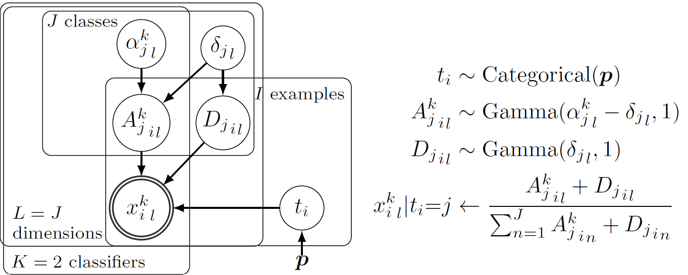
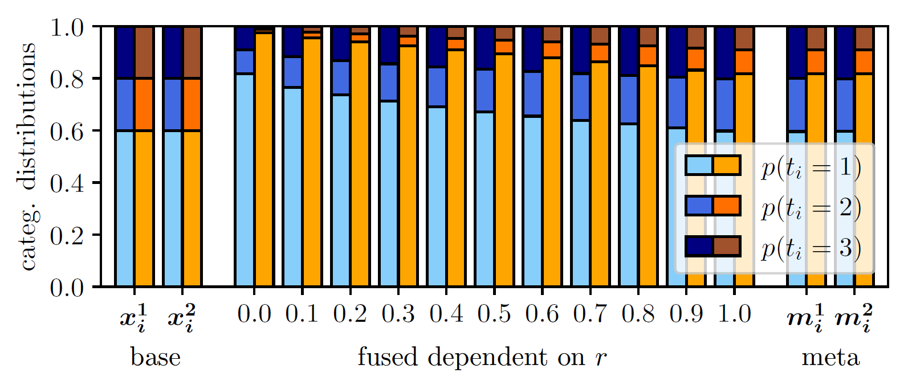

# Bayesian Classifier Fusion with an Explicit Model of Correlation

This repository is the official implementation of the paper "Bayesian Classifier Fusion with an Explicit Model of Correlation" by Susanne Trick and Constantin A. Rothkopf, published at AISTATS 2022. 

We introduce a hierarchical Bayesian model for the fusion of correlated probabilistic classifiers based on a new correlated Dirichlet distribution. 




## Requirements

The provided code runs on Ubuntu 16.04/18.04 with Python 2.7.12.

To install required packages type:

```setup_apt
sudo apt-get install jags
```
tested with versions 4.3.0-3xenial2 on Ubuntu 16.04, 4.3.0-1 on Ubuntu 18.04, and

```setup_pip
pip install -r requirements.txt
```


## Independent Fusion Model (IFM)

The script `independent_fusion_model.py` contains the functionality of the Independent Fusion Model, which is a Bayesian model for the fusion of independent classifiers that output categorical distributions.
It contains the definition of the JAGS model of the Independent Fusion Model and functions for
1. generating simulated classifier outputs (sample_x),
2. inferring the model parameters given observed classifier outputs (sample_alpha), and
3. fusing output distributions according to the model 
    a) using Gibbs sampling (sample_t) or
    b) using the analytical formula shown in equation (2) (fuse_analytical).

Accordingly, if you run
```ifm_data_generation
python independent_fusion_model.py data_generation
```
for some example model parameters, simulated classifier outputs will be generated.
The sampling progress as well as the data's shape is printed and if K=2 classifiers are considered, the generated data are visualized in a scatterplot.

If you run
```ifm_inference
python independent_fusion_model.py inference
```
the generated categorical output distributions are used as training data for parameter inference. The sampling progress as well as the inferred alpha parameters are printed.

If you run
```ifm_fusion
python independent_fusion_model.py fusion
```
two exemplary categorical distributions are fused with the Independent Fusion Model.
The sampling progress as well as the resulting fused distributions using either sampling or the analytical formula in equation (2) are printed.
For comparison, the result distribution fused with Independent Opinion Pool is also printed.

If you run
```ifm_all
python independent_fusion_model.py
```
without any argument, all above steps will be executed sequentially, data generation, parameter inference, and fusion.


## Correlated Fusion Model (CFM)

The script `correlated_fusion_model.py` contains the functionality of the Correlated Fusion Model, which is a Bayesian model for the fusion of correlated classifiers that output categorical distributions.
For simplicity, we only show it for the fusion of 2 classifiers here.
The script contains the definition of the JAGS model of the Correlated Fusion Model and functions for
1. generating simulated classifier outputs (sample_x),
2. inferring the model parameters given observed classifier outputs (sample_delta), and
3. fusing two output distributions according to the model (sample_t).


Accordingly, if you run
```cfm_data_generation
python correlated_fusion_model.py data_generation
```
for some example model parameters, simulated classifier outputs will be generated.
The sampling progress as well as the classifiers' correlations are printed and the data are visualized in a scatterplot.

If you run
```cfm_inference
python correlated_fusion_model.py inference
```
the generated categorical output distributions are used as training data for parameter inference. The marginal parameters alpha of the correlated Dirichlet distribution are inferred using the Independent Fusion Model, which are then assumed to be known for inferring the correlation parameters delta. The sampling progress as well as inferred alpha and delta are printed.

If you run
```cfm_fusion
python correlated_fusion_model.py fusion
```
two exemplary categorical distributions are fused with the Correlated Fusion Model.
The sampling progress as well as the resulting fused distribution are printed. For comparison, the result distributions fused with the Independent Fusion Model and Independent Opinion Pool are also printed.

Note that you can speed up fusion if you decrease nr_samples and nr_adapt and increase nr_chains in `sample_t` according to your available hardware. Details on this can be found in the function's comments.

If you run
```cfm_all
python correlated_fusion_model.py
```
without any argument, all above steps will be executed sequentially, data generation, parameter inference, and fusion.


#### Utils
The script `utils.py` contains some utility functions needed for testing the fusion models:
- create_true_labels: generates a list of true labels for simulating classifier outputs
- iop: defines the fusion rule for Independent Opinion Pool, which we need for comparing the fusion models to Independent Opinion Pool


## Results

If you run
```repl_fusion_behav
python eval_cfm_fusion_behavior.py
```
you can replicate Figure 2 in the paper.

For two examples with different marginal distributions two 3-dimensional categorical distributions are fused with the CFM assuming successively higher correlations between the corresponding base classifiers. The fused distributions are additionally compared to the result distributions of the two meta classifiers that can be obtained when using the IFM with K=1 for each individual classifier.

The figure shows that for both examples (blue bars for example 1, orange bars for example 2) fusion should reduce the fused distribution's uncertainty the less, the higher the correlation between the fused classifiers is. For a correlation of r=1, there should be no uncertainty reduction through fusion. Thus, for both examples, for r = 1, the fused distribution equals the outputs of the meta classifiers. Still, the fused distribution can be less uncertain than the base classifiers due to the marginal Dirichlet models learned for each individual classifiers, which can be seen for example 2 (orange bars).


